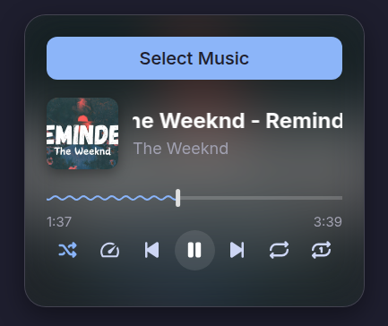
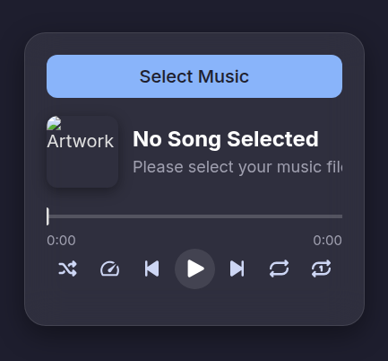
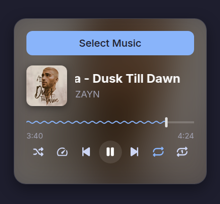

# 🎵 Web Music Player

[](https://developer.mozilla.org/en-US/docs/Web/HTML)
[](https://developer.mozilla.org/en-US/docs/Web/CSS)
[](https://developer.mozilla.org/en-US/docs/Web/JavaScript)
[](LICENSE)
[](../../pulls)

A **modern web-based music player** built using **HTML, CSS, and JavaScript**.  
It combines research from multiple sources, code experiments, and “vibe coding” sessions to reach its current state.  

⚠️ **Note**: Since this was crafted experimentally, there may still be **bugs or edge cases**.  
Community contributions are welcome to refine and fix issues.

---

## ✨ Features

- 🎶 Play, pause, next, previous track  
- 🔀 Shuffle (no back-to-back repeats)  
- 🔁 Repeat modes (off / repeat all / repeat one)  
- 📊 Interactive progress bar (click & drag to seek)  
- 🎼 Tempo & pitch shifting controls  
- 📀 Album art + smooth animations  
- 🖼️ Scrolling song titles (marquee effect for long names)  
- 🌈 Canvas waveform visualizer  
- 🖥️ Responsive design (works across devices)  

---

## 🛠️ Technologies Used

- **HTML5** (semantic structure)  
- **CSS3** (UI, transitions, animations)  
- **JavaScript (ES6+)** (core logic, event handling)  
- **Web Audio API** (visualizer, tempo/pitch shifting)  
- **jsmediatags** (to extract track metadata like title, artist, album art)  

---

## 🚀 Getting Started

1. Clone the repo:
   ```bash
   git clone https://github.com/your-username/musicPlayer.git
2. Open index.html in your browser.
3. Drag & drop your audio files into the player or load them via the file picker.

## 🤝 Contributing

Bugs are expected — **and that’s okay** 🎉

If you spot an issue or want to improve the code:

1. Fork the repo
2. Create a branch (`fix-bug-name`)
3. Submit a Pull Request

---

## 🙌 Acknowledgements

* Inspiration from various open-source audio player projects.
* [MDN Web Docs](https://developer.mozilla.org/) for Web Audio API references.
* [jsmediatags](https://github.com/aadsm/jsmediatags) for metadata parsing.

## 📸 Preview
### Music Player Preview: Different Songs & Speed/Pitch Control

<table>
  <tr>
    <td></td>
    <td></td>
    <td></td>
    <td></td>
  </tr>
</table>

## 📜 License

## License

This project is licensed under the MIT License - see the [licenses/MIT-LICENSE.txt](licenses/MIT-LICENSE.txt) file for details.
